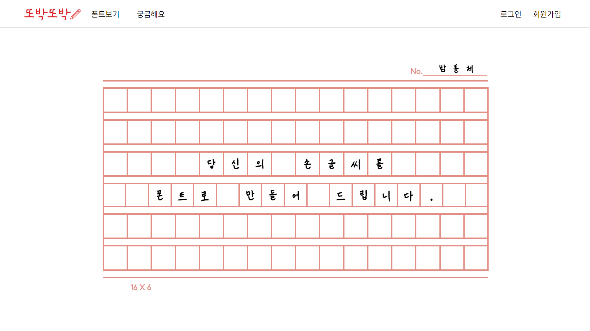
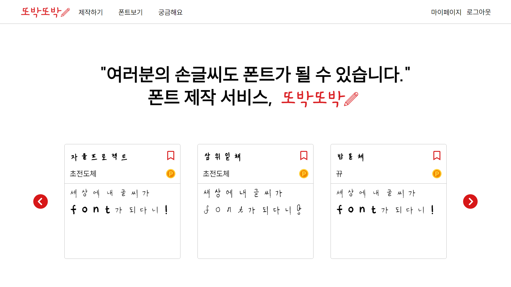
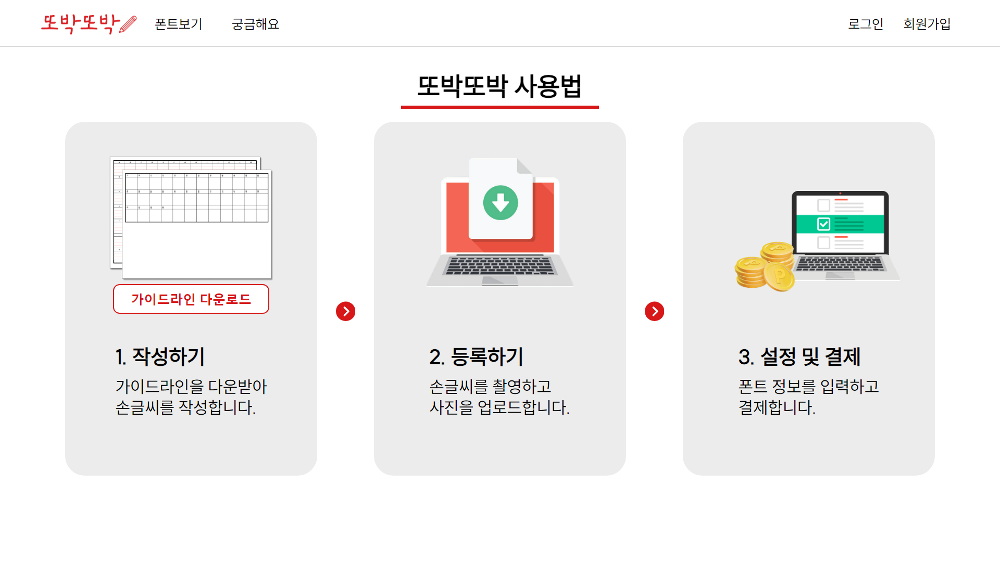
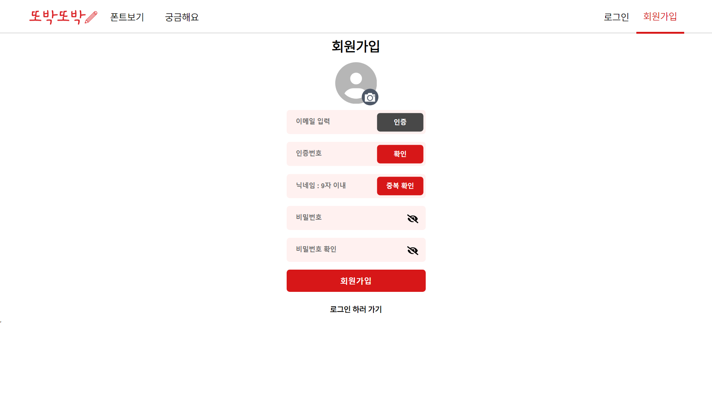

 

### 손글씨가 담고 있는 이야기, 손글씨로 전해지는 마음 

### 당신의 손글씨를 폰트로 만들어 드립니다.

 

어릴 때 꾹꾹 눌러 적은 일기도, 엄마의 어른스러운 글씨도
 
계속 들여다 보게 되는 손글씨

폰트로 오래오래 간직해 보세요.
#### AI 기반 손글씨 제작 서비스 ,

 

**또박또박**을 소개합니다. 😊

 
 

# 📝 또박또박만의 특별한 기능

1.  사용자의 손글씨 업로드 및 **폰트** 생성
2.  생성된 폰트 **미리보기** 
3.  손글씨 폰트의 **온라인 거래 제공**
4.  **포인트 충전 및 결제** 시스템
5.  사용자 간의 손글씨 활용 리뷰 시스템
6.  다양한 **폰트** 검색 및 필터 기능
7.  폰트 **실시간 체험하기** 기능
8.  폰트 **상품 찜하기** 기능
9.  제작자 팔로우 기능

 

## 목차

#### [1️⃣개요](#개요)

#### [2️⃣팀 소개](#-팀-소개)

#### [3️⃣기획배경 및 타겟](#-기획배경-및-타겟)

#### [4️⃣파트별 기능구현 소개](#파트별-기능구현-소개)

#### [5️⃣서비스화면](#서비스화면)

#### [6️⃣사용기술스택](#-사용기술스택)

#### [7️⃣시스템아키텍쳐](#-시스템-아키텍쳐)

#### [8️⃣산출물](#-산출물)

#### [9️⃣협업툴](#-협업툴)

 

## 개요

- 기간 : 2023.10.23. ~ 2023.11.17.

- SSAFY 9기 자율PJT 자유주제 프로젝트

 

## 🙌 팀 소개

|   **Name**   |                                                         이태성                                                          |                                                         김진주                                                          |                                                         이규민                                                         |                                                         이민규                                                         |                                                         이재명                                                          |                                                         이지은                                                         |
| :----------: | :---------------------------------------------------------------------------------------------------------------------: | :---------------------------------------------------------------------------------------------------------------------: | :--------------------------------------------------------------------------------------------------------------------: | :--------------------------------------------------------------------------------------------------------------------: | :---------------------------------------------------------------------------------------------------------------------: | :--------------------------------------------------------------------------------------------------------------------: |
| **Profile**  |  |  |  |  |  |  |
| **Position** |                                              **Team Leader  Frontend**                                              |                                                 **Frontend Design**                                                 |                                                **Backend Release**                                                 |                                                   **AI Release**                                                   |                                                       **Backend**                                                       |                                            **AI Backend Frontend**                                             |

 

## 기획배경 및 타겟

### 기획 배경

    1. 개인화된 표현의 증가: 디지털 시대에 개인의 표현이 중요해지면서, 소비자들은 자신만의 독특한 손글씨를 폰트로 만들고 싶어합니다.

    2. 손글씨 폰트 제작의 비용 문제: 현재 시장에서 손글씨를 폰트로 제작하는 데에는 상당한 비용과 시간이 소요됩니다.

    3. 디지털 수정의 용이성: 수기로 작성된 글씨와 달리 폰트는 수정이 용이하여, 다양한 문맥에서 재사용이 가능합니다.

    4. 디지털 컨텐츠의 개인화 추세: 개인적인 감성을 담은 컨텐츠 제작에 대한 수요가 증가하고 있습니다.

### 타겟층

    - 창의적인 개인 사용자: 자신만의 개성을 표현하고자 하는 개인 사용자들로, 개인 블로그, 소셜 미디어 등에서 독특한 폰트를 활용하고자 합니다.

    - 디자인 전문가: 그래픽 디자이너, 광고 전문가 등 비주얼 콘텐츠 제작자들로, 프로젝트에 독특한 터치를 추가하고자 합니다.

    - 중소기업 및 스타트업: 브랜딩과 마케팅 자료에서 기업의 정체성을 강조하기 위해 개성 있는 폰트를 찾는 기업들.

    - 교육 및 아카데믹 분야: 교육 자료, 프레젠테이션 등에서 개인적인 느낌을 주고자 하는 교육자 및 연구원들.

### 서비스 소개

    - 개인화된 폰트 제작: 사용자는 간단한 절차를 통해 자신의 손글씨를 디지털 폰트로 쉽게 변환할 수 있습니다. 이를 통해 블로그, 문서, 그래픽 디자인 등 다양한 분야에서 개성 있는 표현이 가능해집니다.

    - 저렴하고 효율적인 프로세스: 전통적인 폰트 제작 방식에 비해 비용과 시간을 크게 절약할 수 있어, 누구나 쉽게 접근할 수 있습니다.

    - 사용자 친화적 인터페이스: 직관적인 사용자 인터페이스를 통해 누구나 쉽게 손글씨를 디지털 폰트로 변환할 수 있습니다. 복잡한 기술 지식이 필요 없습니다.

    - 다양한 적용 가능성: 제작된 폰트는 개인 블로그, 소셜 미디어, 그래픽 디자인, 기업 브랜딩 자료 등 다양한 곳에 활용될 수 있습니다.

 

## 파트별 💻 기능구현 소개

### Back-end

    회원가입, 아이디 중복체크, 로그인, 로그아웃, 이메일 인증, 이메일 인증 확인
    회원가입시 이메일 인증번호 전송
    JWT토큰을 발급해 로그인을 유지시키도록 함
    
    
### Front-end

    react-router를 통한 페이지 분할 및 ProtectedRoute/PublicRoute 구분을 통해 url 직접 접근 차단
    react-router의 children과 outlet을 통해 새로고침 되지 않는 페이지 전환 구현(사용자 UX 개선)
    props를 통한 상위/하위 컴포넌트간 데이터 전송, querystring을 통한 페이지 간 데이터 전송
    axios를 통한 backend 서버와 통신
    useState를 통한 상태 관리
    backend 서버에서 보낸 캐릭터 좌표를 css 뷰포트 좌표로 변환하여 화면상에 캐릭터 이미지 표출
    getBoundingClientRect()를 사용하여 타겟 요소의 위치 파악, 미션 구현

### AI

    

<!-- 예시
### Front-end (수정해야 함)
    - react-qr 이용하여 QR코드 카메라 인식
    - 지도API 연동
    - IMPORT 연동 r
    - KakaoMap을 이용하여 키오스크 현황 제공
    - D3.js를 이용하여 관리자 통계정보 제공 (수익추이, 사용횟수, 사용자별 이용내역, 사용자 계정정보 관리)
    - Back-end에서 제공한 JWT 토큰을 이용해서 로그인 구현

### Back-end
    - JWT토큰을 이용한 회원가입, 로그인, 회원정보 조회, 회원정보 수정, 회원탈퇴, 아이디 찾기, 비밀번호 찾기 구현 (사용자, 사장님)
    - 사장님 페이지에 매출관리 기능제공 (일별 및 월별 수익현황 등)
    - 상점, 상품, 장바구니. 주문, 결제, 키워드, 찜, 후기 등 구현
    - Zxing, UUID 를 이용한 QRCode, 소소티콘 생성
    - Amazon S3 를 이용한 QRCode이미지 업로드(보안의 측면)
    - Swagger/OpenAPI를 이용하여 API 명세서 구현
 -->

 

## 사용기술스택

- Front-End-Web
  - React.js
  - TypeScript
  - Iamport
  - Redux(Redux-Toolkit)
  - styled-components
  - eslint, prettier
  - jszip
- Backend
  - Database: MariaDB
  - Web: SpringBoot
- CI/CD
  - Docker
  - Jenkins
  - Nginx
- Server
  - AWS EC2
- AI

 

| Tech         | Stack                |
| ------------ | -------------------- |
| **Language** | TypeScript, Java     |
| **Backend**  | Java SpringBoot      |
| **Frontend** | React, React-Native  |
| **Database** | MariaDB              |
| **Server**   | AWS EC2              |
| **DevOps**   | Git, Docker, Jenkins |

 

## 시스템아키텍쳐

 

 

## 서비스화면

### 1. 사용자 웹

|                  메인1                   |                  메인2                   |                  메인3                   |                    고객문의                    |
| :--------------------------------------: | :--------------------------------------: | :--------------------------------------: | :--------------------------------------------: |
|  |  |  |  |

|         회원가입        |        이메일인증    |    이메일수신    |    폰트상세보기           |
| :---------------------------------------: | :-----------------------------------------: | :-----------------------------------------: | :-------------------------------------------: |
|  |  |  |  |

|                  마이페이지                   |                  찜목록                  |                  구매내역                   |                  상점상세                   |
| :-------------------------------------------: | :---------------------------------------: | :-----------------------------------------: | :-----------------------------------------: |
|  |  |  |  |

 

## 산출물

### - PPT

[특화PJT*광주\_1반\_C109*발표자료.pptx](./exec/특화PJT_광주_1반_C109_발표자료.pptx) (\*.pptx)

### - 포팅 매뉴얼

[포팅 매뉴얼](./exec/포팅메뉴얼.pdf) (\*.pdf)

 

## 협업툴

|                GITLAB                 |                 JIRA                  |
| :-----------------------------------: | :-----------------------------------: |
|  |  |

